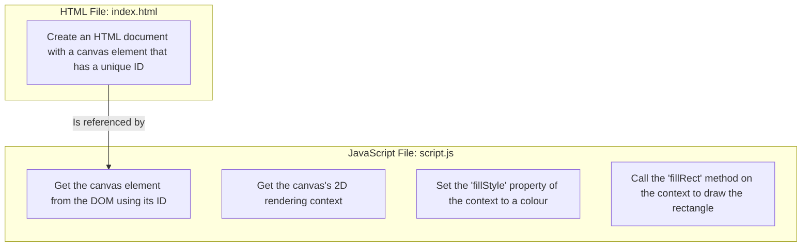

# Drawing a 2D shape

**Related Concepts:** [[geometrica-project-hub]], [[html-canvas]], [[javascript]], [[2d-rendering-context]]

---

## Story

*I want to see a simple 2D shape (a rectangle) on the screen so I can understand the absolute basics of rendering graphics in a web browser.*

## Design

This flowchart outlines the steps required to render a 2D shape. The design separates the structural HTML from the behavioural JavaScript, which will be in two separate files.

## Implementation log and discoveries

- Canvas and WebGL APIs
  - These APIs can only be accessed via JavaScript and require a reference to the unique ID of the HTML canvas element.
- HTML structure and DOM
  - This is where the canvas element is defined and referenced so it can be accessed by JavaScript and CSS.
- Objects, APIs, methods, and elements
  - I find it confusing that an API can be created from a variable that is assigned an object.
    - This can make it feel nested, especially when you define multiple APIs from nested variables.
    - So an object is an abstraction that represents...
- Seeing the width and height of the canvas with `canvas.width` and `canvas.height`
- `fillStyle` and `fillRect` methods
